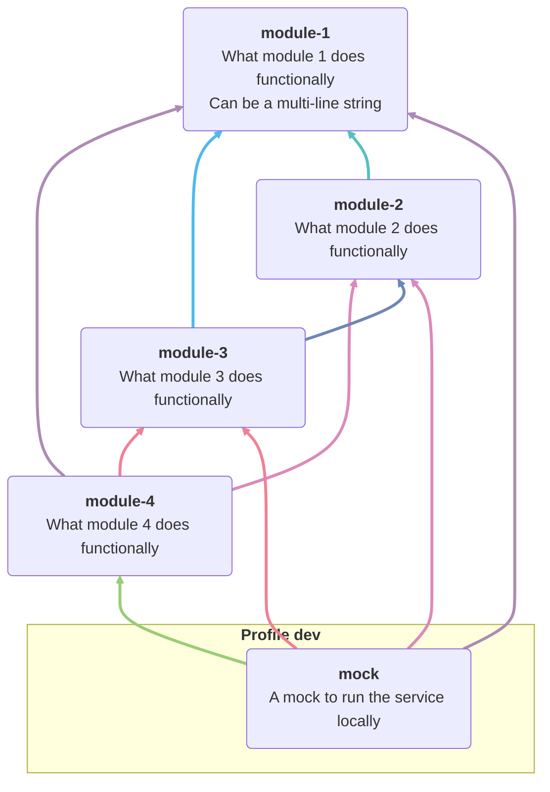

<!-- Formatted by https://github.com/quilicicf/markdown-formatter -->

# arch-graph-maker-maven-plugin

A Maven plugin to generate a Mermaid architecture graph from your pom and write it in your documentation files.

## How it works

It reads the pom where it's added as a plugin and generates a graph of all its modules (even those defined only in profiles) with links marking the dependencies between modules.

It uses the `artifactId` & `description` fields of module poms to document what each module is about.

## Usage

Use with [JitPack](https://jitpack.io/) for now. I might be talked into releasing on Maven central in the future, no promises.

```xml
<project xmlns="http://maven.apache.org/POM/4.0.0"
				 xmlns:xsi="http://www.w3.org/2001/XMLSchema-instance"
				 xsi:schemaLocation="http://maven.apache.org/POM/4.0.0 http://maven.apache.org/maven-v4_0_0.xsd">

	<modelVersion>4.0.0</modelVersion>
	<groupId>quilicicf</groupId>
	<artifactId>my-project</artifactId>

	<pluginRepositories>
		<pluginRepository>
			<id>jitpack.io</id>
			<url>https://jitpack.io</url>
		</pluginRepository>
	</pluginRepositories>

	<build>
		<plugins>
			<plugin>
				<groupId>com.github.quilicicf</groupId>
				<artifactId>arch-graph-maker-maven-plugin</artifactId>
				<version>1.0.0</version>
				<inherited>
					<!-- Required so that the plugin is only run on the parent pom and not all submodules! -->
					false
				</inherited>
				<configuration>
					<!-- Configuration below is the default one (so same as if you don't put any conf at all -->
					<shouldDisplayGraphInLogs>false</shouldDisplayGraphInLogs>
					<shouldColorLinks>true</shouldColorLinks>
					<docType>
						<!-- Possible values listed in enum DocType see link below graph -->
						MARKDOWN
					</docType>
					<relativePathToDocFile>README.md</relativePathToDocFile>
					<startTag>START: ARCHITECTURE SCHEMA</startTag>
					<endTag>END: ARCHITECTURE SCHEMA</endTag>
				</configuration>
			</plugin>
		</plugins>
	</build>
</project>
```

> Note: supported doc types are available in [the Doctype enum](./src/main/java/quilicicf/domain/data/DocType.java).

Then add the start/end tags in your documentation file (here, README.md) in comments:

```markdown
# My project, blabla

<!-- START: ARCHITECTURE SCHEMA -->
<!-- END: ARCHITECTURE SCHEMA -->
```

It also works with AsciiDoc:

```asciidoc
= My project, blabla

// START: ARCHITECTURE SCHEMA
// END: ARCHITECTURE SCHEMA
```

## The result

Here's the graph generated in [the tests](./src/it/README.md):



> Note: the colors are there because it's rather easy to reach a level of complexity where arrows overlap and the graph is harder to read. Adding colors alleviates the issue. They have been selected to be distinct while having an average lightness to work in light and dark modes.
