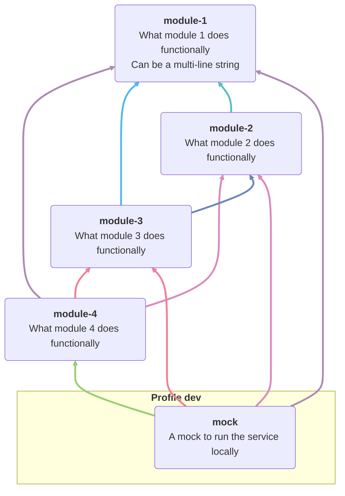

<!-- Formatted by https://github.com/quilicicf/markdown-formatter -->

# My project

<!-- TOC START -->

* [Architecture](#architecture)

<!-- TOC END -->

## Architecture

<!-- START: ARCHITECTURE SCHEMA -->

<!-- END: ARCHITECTURE SCHEMA --> 
